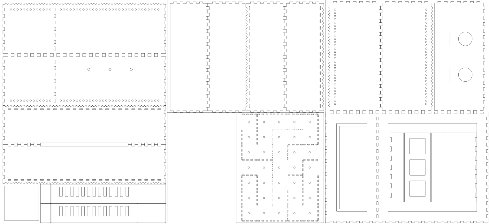

# CAD Library
MATLAB library to create drawings programmatically.<br>
A `svg` file can be generated then exported to a CNC machine for manufacturing parts.



# Installation
- Install [MATLAB][MATLAB]
- Download and extract the [CAD library][project] to the `Documents/MATLAB` folder.
- Run `startup.m` every time you start MATLAB to add path to the library.

# Usage and examples
For the complete documentation, run `help CAD` in the MATLAB prompt. <br>
See [Enrichment Chamber][enrichment-chamber] for a complex example.

The examples below assume a large kerf value for displaying purposes. For a typical laser cutting machine this value can be set to zero or a much smaller value since there is not much material loss to compensate for.


## Square sheet with finger joints
```MATLAB
      h = 9;
      v = 9;
      width = 3;
      height = 1;
      kerf = 0.1;
      protrude = true;
      vars = {width, height, kerf, protrude};
      
      box = CAD();
      box.tooth('N|1011]', h, vars{:});
      box.tooth('E:1011]', v, vars{:});
      box.tooth('S:1001|', h, vars{:});
      box.tooth('W|1001|', v, vars{:});
      
      cla();
      plot(box.x, box.y);
      axis('equal');
```

## Matching holes for finger joints
```MATLAB
	n = 10;
	width = 3;
	height = 1;
	kerf = 0.1;
	vars = {width, height, kerf};

	even = CAD();
	even.slit('E0', n, vars{:});

	cla();
	hold('all');
	plot(even.x, even.y);
	axis('equal');
```

## Waves
```MATLAB
	n = 5;
	width = 5;
	height = 2;
	kerf = 0.5;

	model = CAD();
	model.wave('E0', n, width, height, 0);

	outer = CAD();
	outer.wave('E0', n, width, height, kerf);

	inner = CAD();
	inner.wave('e0', n, width, height, kerf);

	cla();
	hold('all');
	plot(model.x, model.y, '--', 'DisplayName', 'Model');
	plot(outer.x, outer.y, 'DisplayName', 'Outer');
	plot(inner.x, inner.y, 'DisplayName', 'Inner');
	legend('show');
	axis('equal');
```

## License
© 2021 [Leonardo Molina][Leonardo Molina]

This project is licensed under the [GNU GPLv3 License][LICENSE].

[project]: https://github.com/leomol/cad-library
[enrichment-chamber]: https://github.com/leomol/enrichment-chamber
[license]: src/LICENSE.md
[Leonardo Molina]: https://github.com/leomol
[MATLAB]: https://www.mathworks.com/downloads/